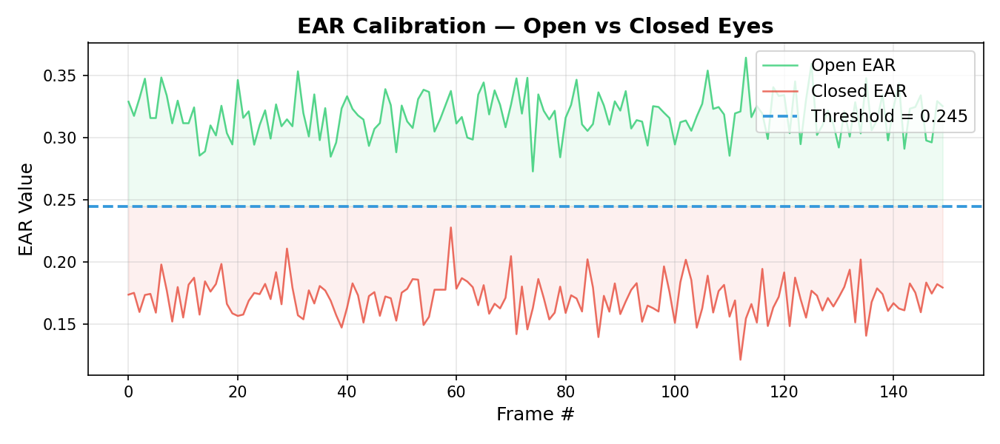
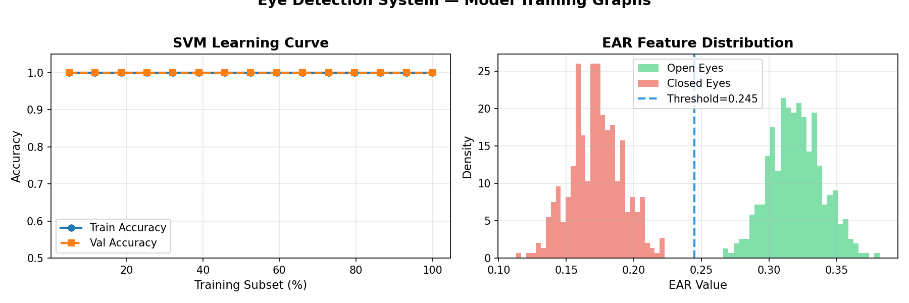

# 👁️ Eye Detection Based Alarm System

**Name:** Chandan Bansal &nbsp;|&nbsp; **Roll No:** 1024240147 &nbsp;|&nbsp; **Group:** 2X12

---

## 📄 Project Abstract

Driver drowsiness is one of the leading causes of road accidents worldwide.
This project presents a **real-time Eye Detection Based Alarm System** that
monitors a person's eyes through a webcam and automatically sounds a horn
alarm when the eyes remain closed beyond a configurable threshold.

The system uses the **dlib 68-point facial landmark predictor** to locate
eye regions frame-by-frame, computes the **Eye Aspect Ratio (EAR)** —
a lightweight, lighting-robust metric — and counts consecutive frames where
EAR falls below the alert threshold. When the count exceeds the defined
limit (default: 20 frames ≈ 0.67 s at 30 fps), an alarm is triggered
immediately.

### Key Highlights
| Feature | Detail |
|---|---|
| Detection Method | dlib HOG face detector + 68-pt landmark predictor |
| Eye Metric | Eye Aspect Ratio (EAR) |
| Alarm Mechanism | pygame audio / system beep fallback |
| Optional ML Layer | RBF-kernel SVM trained on EAR features |
| Platform | Windows / Linux / macOS (Python 3.9+) |
| Input | Webcam (index 0) or any video file |

---

## 🎬 Project Output (Video)

> **Demo video:** `output/output_recording.avi`
>
> To play the recorded output:
> ```bash
> python -c "import cv2; cap=cv2.VideoCapture('output/output_recording.avi'); \
>            [cv2.imshow('Demo',cap.read()[1]) or cv2.waitKey(30) for _ in range(9999)]"
> ```
>
> The output window displays:
> - Live EAR value and eye-open/closed status
> - FPS counter and per-frame inference time
> - Landmark contours around both eyes
> - Full-width red alert banner when drowsiness is detected

---

## 🧠 Models Used & Training Graphs

### 1. dlib Shape Predictor (68 Facial Landmarks)
- **Type:** Pre-trained HOG + Regression Tree model
- **File:** `models/shape_predictor_68_face_landmarks.dat`
- **Source:** [dlib.net model zoo](http://dlib.net/files/shape_predictor_68_face_landmarks.dat.bz2)
- **Usage:** Localises 68 keypoints on the face; eye landmarks (36–47) are
  used to compute EAR.
- **No training required** — the model is used as-is for inference.

### 2. EAR Calibration (User-Adaptive Threshold)
The `training.py` module provides an **interactive calibration routine** that
records EAR values for eyes-open and eyes-closed states and picks the midpoint
as the detection threshold.

**Calibration Graph:**



### 3. Optional SVM Classifier
An optional **RBF-kernel Support Vector Machine** (scikit-learn) can be trained
on EAR feature vectors for improved robustness over a fixed threshold.

**SVM Learning Curve & Feature Distribution:**



---

## 🚀 Setup & Usage

### 1. Prerequisites
```bash
# Python 3.9+
pip install -r requirements.txt
```

### 2. Download dlib Model
```bash
# Linux / macOS
wget http://dlib.net/files/shape_predictor_68_face_landmarks.dat.bz2
bzip2 -d shape_predictor_68_face_landmarks.dat.bz2
mv shape_predictor_68_face_landmarks.dat models/

# Windows (PowerShell)
Invoke-WebRequest http://dlib.net/files/shape_predictor_68_face_landmarks.dat.bz2 -OutFile model.bz2
# then extract with 7-Zip and move to models\
```

### 3. Run
```bash
python main.py
```

Press **`q`** in the display window to quit.

### 4. (Optional) Calibrate threshold for your face
```bash
python training.py
```
Follow the on-screen instructions to record open/closed eye samples.

---

## 📁 Project Structure

```
eye_detection_project/
├── main.py             # Entry point — initialise, loop, display, save
├── preprocessing.py    # Frame prep & landmark extraction
├── inference.py        # Per-frame inference pipeline
├── training.py         # EAR calibration + SVM training
├── utils.py            # Helper functions (EAR, alarm, drawing)
├── config.py           # All configuration constants
├── logger.py           # File + console logger
├── requirements.txt    # Python dependencies
├── models/             # Pre-trained & saved model files
├── assets/             # alarm.wav
├── logs/               # eye_detection.log
└── output/
    ├── output_recording.avi
    └── training_graphs/
        ├── ear_calibration.png
        └── svm_learning_curve.png
```

---

## 📚 References

- Soukupová & Čech (2016) — *Real-Time Eye Blink Detection using Facial Landmarks*
- dlib C++ Library — http://dlib.net
- OpenCV — https://opencv.org
